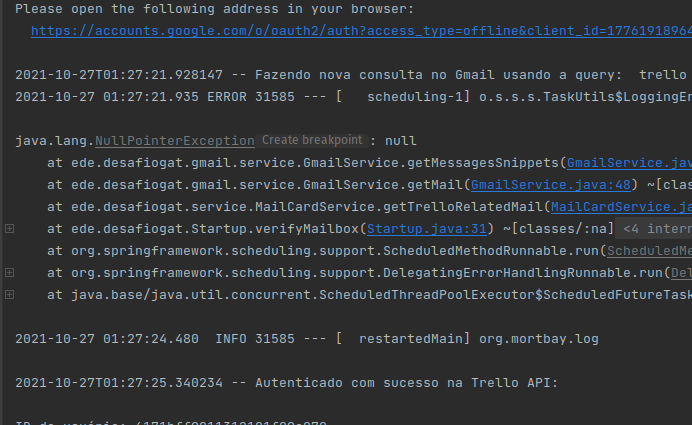
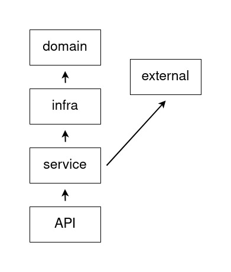
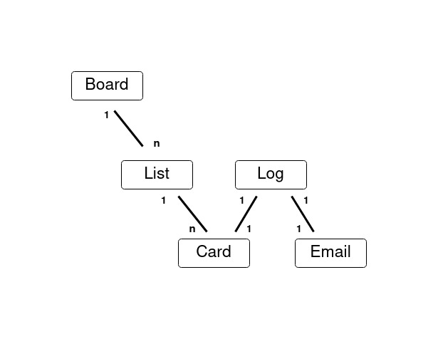
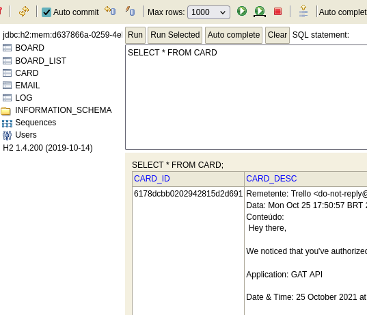

# Desafio GAT Infosec - Backend

## Rodando a aplicação

A ideia é que se execute a versão da branch main, existe uma outra branch mas eu explico sobre ela nas considerações finais.

Essa aplicação usa:

- JDK 14 (java-1.14.0-openjdk)
- Maven 3.6.3

Depois de importar o projeto na ide algumas coisas precisam ser configuradas:

1. É preciso colocar um arquivo credentials.json em src > main > resources. Pra obter esse arquivo é preciso [criar um projeto](https://developers.google.com/workspace/guides/create-project) na Google Cloud Platform e depois [obter as credenciais](https://developers.google.com/workspace/guides/create-credentials) para este projeto.

2. É preciso também colocar um arquivo chamado trello-credentials.json, no mesmo diretório. Esse arquivo deve ser criado manualmente usando o modelo que eu deixei [nesta pasta do repositório](). Esse modelo já contém a chave pública da minha API, mas você obter a sua própria chave e o seu token seguindo [este tutorial](https://developer.atlassian.com/cloud/trello/guides/rest-api/api-introduction/) (certifique-se de obter um token com permissões de leitura e escrita). Pra se autenticar usando a chave pública da minha API basta seguir este [link](https://trello.com/1/authorize?expiration=30days&name=GAT+API&scope=read,write&response_type=token&key=806a81615df0426dbe3e72d8561c5b19) e aceitar as permissões. Você será direcionado pra uma página contendo um token. Aí é só copiar e colocar no arquivo json.

Jamais publique o seu token. Ele dá acesso à sua conta do Trello.

Se tudo ocorrer como previsto, basta executar a classe principal através da IDE ou, através do terminal, rodar o comando:
`mvn spring-boot:run`

## Observações:

Logo que a aplicação sobe, ela executa uma inicialização que obtém acesso ao Google e verifica as credenciais do Trello. Da forma como está, ele não captura erros caso as credenciais do trello não sejam válidas, então se a aplicação quebrar logo de cara verifique se as credencias estão de acordo com o instruído. 

Pra obter acesso ao Google é realizada uma autenticação via OAuth2. Uma janela possivelmente vai abrir no navegador pedindo permissões de acesso. Se não abrir, um  link vai ser mostrado na console pra chegar nessa tela. Após conceder as permissões a API do Google automaticamente vai guardar o token e continuar a execução.

Nessa parte pode ocorrer um problema: Existe um scheduler programado pra verificar a caxa de email a cada 15 segundos a partir do início da aplicação. Ele tem um delay inicial de 30 segundos. Acontece que se a autenticação do Google não acontecer dentro desses 30 segundos ele vai tentar fazer uma busca e provavelmente vai dar um NullPointerException.

Não chega a parar a execução mas é algo pra se ter em mente.

## O Desafio

Essa é a minha solução pro desafio backend do processo seletivo da [GAT Infosec](https://www.gat.digital/).

O desafio era criar um backend em Java que utilizasse as API's do Gmail e do Trello para executar as seguintes tarefas:

- Monitorar a caixa de entrada do Gmail buscando quaisquer email que contivessem a palavra "Trello".
- A partir destes emails, criar um novo card no Trello onde o título é o assunto do email e descrição, o corpo da mensagem.
- Persistir os dados em banco de dados local.
- Gerar um log registrando os intervalos de monitoramento e a criação de novos cards.
- Expor dados da API pra consultas.

Se possível também:

- Mover um card pra uma lista de emails lidos se o email correspondente for aberto no Gmail.
- Adicionar um label "importante" no card se o email correspondente for marcado com estrela.

## Camadas

- Services: Essa camada contém os serviços da Api que seriam responsáveis por tratar as informações e mandar para o database (infra). Eu implementei um LogService, que fica responsável por persistir os dados e registrar os logs, e um MailCardService (na falta de nome melhor), pra obter os DTOs da camada externa.
- External: Camada de serviços externos (Gmail e Trello API), responsável por obter e enviar dados das apis externas e retornar DTOs pra Services. Dentro dessa camada eu criei um service pra cada api (GmailService e TrelloService)
- Infra: A parte de persistência, é onde ficam as interfaces repositories do Spring Data.
- Domain: Onde estão mapeadas as entidades e também onde eu coloquei as interfaces mapper.

## Modelo de dados

Por causa desafio que foi trabalhar com as apis do Trello e do Gmail eu acabei não dispondo de muito tempo pra focar da parte de persistência. A minha proposta de modelagem seria mais ou menos como esboçado no seguinte diagrama:

Board, List, Card e Email aproveitam os ids fornecidos tando pela api do Gmail quando a do Trello. Assim eu poderia aproveitar esses ids pra fazer buscas de forma mais específica, embora eu não tenha dado conta de aproveitar muito bem esse recurso.

A entidade Log seria por onde eu recuperaria os registros pra consulta e montaria os logs. No LogService eu implemento o método getLastCheck() pra verificar se existe algum log, e se tiver, recuperar a data em que ele foi registrado. Eu utilizo essa data pra montar uma query no Gmail que retorne só os emails recebidos após a última busca. 

## Persistência

Pra persistência de dados eu utilizei o H2, pela simplicidade. Na inicialização do Spring você encontra as informações pra acessar a console do H2 através da URL localhost:8080/h2-console.

## Considerações finais

Infelizmente a minha tentativa de mapeamento das entidades não funcionou muito bem conforme pode ser checado na branch "persistence-methods", isso é porque eu tive pouca prática com modelos com mais de duas tabelas. A forma como eu deixei na branch "main" é a forma como eu gostaria de apresentar o funcionamento. Não tive tempo de implementar endpoints e nem de fazer um tratamento correto das exceções. Também a parte de logs não funciona muito bem, a ideia era utilizar, além da entidade logs, uma biblioteca de logger pra gerar arquivos de logs mais detalhados, mas isso não deu pra fazer. 

Esse foi um projeto bem complexo e cada etapa foi um desafio a parte. A aplicação está longe de funcionar perfeitamente mas eu 
me sinto satisfeito com o tanto que eu consegui fazer nessa semana em que trabalhei nele e pretendo eventualmente terminá-lo com todas as funcionalidades, e quem sabe a parte do Frontend também.